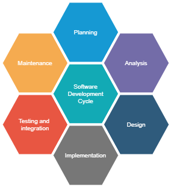
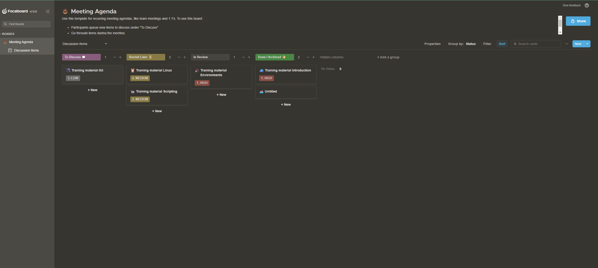

#########################
1. Introduction to DevOps
#########################

===============
What is DevOps?
===============

.. note::

	DevOps is a software development approach that combines the practices of software development and IT operations to create a culture of collaboration and automation. The goal of DevOps is to improve the speed and quality of software delivery, while also increasing the reliability, scalability, and security of the software.

DevOps is based on several key principles, including:

	#. **Continuous integration and continuous delivery**: This involves automating the process of building, testing, and deploying software, so that code changes can be integrated and deployed quickly and easily.
	#. **Configuration and Infrastructure as code**: This involves using tools and techniques to automate the provisioning and management of IT infrastructure, such as servers, networks, and storage.
	#. **Monitoring and logging**: This involves using tools and techniques to monitor the performance and health of software systems, and to log any issues or errors that occur.
	#. **Security**: This involves incorporating security best practices and tools into the software development process, to ensure that the software is secure and that any vulnerabilities are identified and addressed quickly.

DevOps is not a specific role or job, it's more of a culture and a way of working. It requires close collaboration between developers, operations, and other teams involved in the software development process. It also requires the use of automation tools and technologies, such as containerization, configuration management, and continuous integration and delivery platforms.

DevOps is a **set of practices** that combines software Development (Dev) and IT operations (Ops). It aims to shorten the systems' development life cycle and provide continuous delivery with high software quality.

Overall, DevOps helps organizations to deliver software faster, with higher quality and reliability, while also reducing risks and improving the overall performance and security of the software.

It relies on **automation** (Python, Ansible, and Terraform) to enforce the best practices - deploy the code from git to the environment.

.. image:: ../diagrams/devops.png
  :width: 800
  :alt: DevOps Stages

===========  ========================================================================  =====================================
Stages       What happens                                                              Tools used
===========  ========================================================================  =====================================
**Plan**     decide what to do                                                         azure boards, kira, focalboard
**Code**     do                                                                        vscode, vim, emacs intelij, eclipse
**Build**    create a package/binary from the code we have written                     setup, maven, gradle, ant, sbt, poetry
**Test**     check if the code is working, secure, performant, and reliable            pylint, pytest, mypy, behave
**Release**  from all the builds decide what is a stable version                       github actions, artifactory
**Deploy**   install the stable version of the package on the environment              ansible, terraform
**Operate**  keep the application running                                              gcp, aws, azure
**Monitor**  get information from the running system to see what needs to be improved  grafana, loki, prometheus, nagios
===========  ========================================================================  =====================================

===============================================
Site Reliability Engine(SRE) vs DevOps Engineer
===============================================

.. note::

	Site Reliability Engineer is a new role added to the software development process, meant to fill the gap between development and operations teams. Communication, efficiency, and adaptability are all improved through this role.

=============  ===============================================================================================================  =============================================================================================
_              SRE                                                                                                              DevOps 
=============  ===============================================================================================================  =============================================================================================
Mission        Operations                                                                                                       Delivery
Works on       Incident response                                                                                                Release Automation
Improves       Post Mortem                                                                                                      Environment builds
Preparation    Monitoring, Events, Alerts                                                                                       configuration management
Increase       Capacity planning                                                                                                Infrastructure as a code
Primary focus  Reliability                                                                                                      Delivery Speed
Main role      Operational problems: production failures, infrastructure issues (disk, memory, network), security, monitoring.  Solve the development problems, and work on the CI/CD Pipeline - build, test, release, deploy
=============  ===============================================================================================================  =============================================================================================

==============
CI/CD pipeline
==============

Continuous integration

	Is a DevOps software development practice where developers regularly merge their code changes into a central repository(usually git: GitLab, GitHub, bitbucket, or azure repo), after which automated builds and tests are run. Continuous integration most often refers to the build or integration stage of the software release process and entails both an automation component (e.g. a CI or build service) and a cultural component (e.g. learning to integrate frequently). The key goals of continuous integration are to find and address bugs quicker, improve software quality, and reduce the time it takes to validate and release new software updates.

Continuous delivery
	
	Is a software development practice where code changes are automatically prepared for a production release. A pillar of modern application development, continuous delivery expands upon continuous integration by deploying all code changes to a testing environment and/or a production environment after the build stage. When properly implemented, developers will always have a deployment-ready build artifact that has passed through a standardized test process.

CI/CD pipeline is a process to take the code to production, having usually 7 steps:
	#. **Coding** - code development and review, source code management tools, code merging.
	#. **Building** - continuous integration tools, build status.
	#. **Testing** - continuous testing tools that provide quick and timely feedback on business risks.
	#. **Packaging** - artifact repository, application pre-deployment staging.
	#. **Releasing** - change management, release approvals, release automation.
	#. **Configuring** - infrastructure configuration and management, infrastructure as code tools.
	#. **Monitoring** -  applications performance monitoring, end-user experience.

==========================================================
What is Software Development Lifecycle Management or SDLC?
==========================================================

.. note::
	
	Everything dies - even software

All the applications will be created, updated, reworked, and removed.

**Software Development Life Cycle** (SDLC) Management is a process that aims to develop software with the lowest cost, the highest quality, and in the shortest time. It also includes detailed documentation for how to develop, extend, and maintain the software system. A Software Development Life Cycle involves several stages, including requirements gathering, planning/designing, building, testing, and finally deployment.

Teams following the best practices of the Software Development Life Cycle Management process see more success and have an easier time developing software in stages. The SDLC process applies equally well for Minimum Viable Products which are part of the Lean Startup approach, as well as full-blown projects.

The main stages of the Software Development Life Cycle Management process include
	#. **Identify Requirements**: The first stage is about understanding the problems you are trying to solve, and what the software needs to do.
	#. **Plan & Design**: Taking into account the requirements, the next step is to plan and prioritize the features that need to be created. This phase can and should include some research to validate technologies and approaches.
	#. **Build / Code**: This stage is one of the longest, and where much of the work is done. It should overlap to some degree with the following Documentation and Test phase.
	#. **Test / Debug / Document**: Documenting and testing should happen during the build stage as well, but this stage is where the focus turns from developing features to bug fixing and stabilizing the software for launch to customers. Often Alpha and Beta versions are released in this phase to ensure configuration and other rare or hard-to-spot bugs are found and fixed.
	#. **Deploy**: The final deployment stage is where the software is released for customers to use and goes live
	#. **Maintenance**: This phase involves ongoing support and improvement of the software after it has been deployed. It includes bug fixing, updating the software to meet new requirements, and ensuring the software continues to function properly.

SDLC management is critical for the success of any software development project. It helps to ensure that the software is developed on time, within budget, and to the required quality standards. It also helps to identify and mitigate risks, improve communication and collaboration among team members, and ensure that the software meets the needs of the end users.

========================================================
Software Development Life Cycle Management methodologies
========================================================

.. note::

	Agile is a methodology for managing software development projects. It is based on the Agile Manifesto, a set of guiding values and principles that prioritize flexibility, collaboration, and customer satisfaction. Agile emphasizes an iterative, incremental approach to software development that allows teams to quickly respond to changing requirements and deliver working software in small increments.

The Agile methodology is often used in conjunction with Scrum, a specific framework for managing and completing complex projects. Scrum is based on Agile principles and provides a structure for organizing and managing the development of software in an Agile environment. It includes roles such as Product Owner, Scrum Master, and Development Team, and events such as Sprint Planning, Daily Scrum, Sprint Review, and Sprint Retrospective to ensure a smooth and effective development process.

The key principles of Agile include:

	#. Individuals and interactions over processes and tools
	#. Working software over comprehensive documentation
	#. Customer collaboration over contract negotiation
	#. Responding to change by following a plan

Agile allows teams to deliver value to customers faster and with more flexibility, while also allowing them to adapt to changing requirements and market conditions. It encourages collaboration and communication among team members, and it emphasizes a culture of continuous improvement. Agile is widely adopted in software development, IT, and other industries because of its ability to handle complexity, uncertainty, and changing requirements.

=====
Agile
=====

.. image:: ../diagrams/agile.jpg
  :width: 800
  :alt: SCRUM Agile Model

Agile development is a term used to describe iterative software development. Iterative software development shortens the DevOps lifecycle by executing against work in smaller increments, usually called **sprints**. Sprints are typically 1-4 weeks long. Agile development is often contrasted with traditional or waterfall development, where larger projects are planned upfront and executed against that plan.

.. image:: ../diagrams/scrum.png
  :width: 800
  :alt: SCRUM Agile Model

.. note::

	SCRUM is a framework within which people can address complex adaptive problems, while productively and creatively delivering products of the highest possible value.

In a nutshell, Scrum requires a Scrum Master to foster an environment where:
	#. A Product Owner orders the work for a complex problem into a Product Backlog.
	#. The Scrum Team turns a selection of the work into an Increment of value during a Sprint.
	#. The Scrum Team and its stakeholders inspect the results and adjust for the next Sprint.
	#. Repeat

======
Kanban
======

.. note::

	Kanban (Japanese: 看板, meaning signboard or billboard) is a lean method to manage and improve work across human systems. This approach aims to manage work by balancing demands with available capacity, and by improving the handling of system-level bottlenecks.

Work items are visualized to give participants a view of progress and process, from start to finish—usually via a **Kanban board**. Work is pulled as capacity permits, rather than work being pushed into the process when requested.

